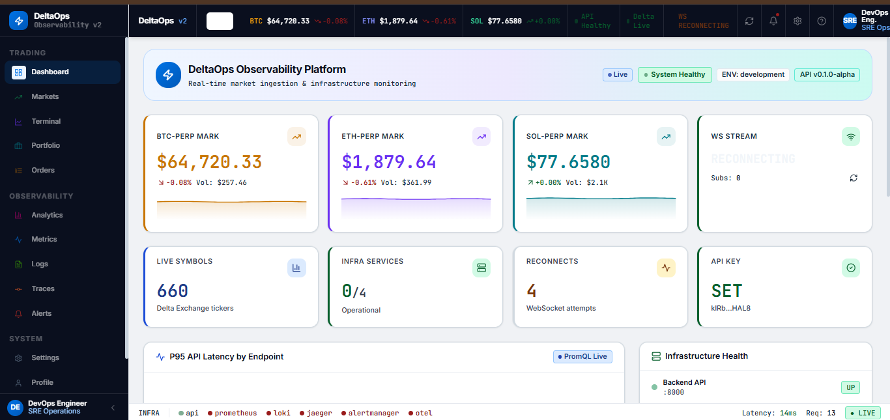
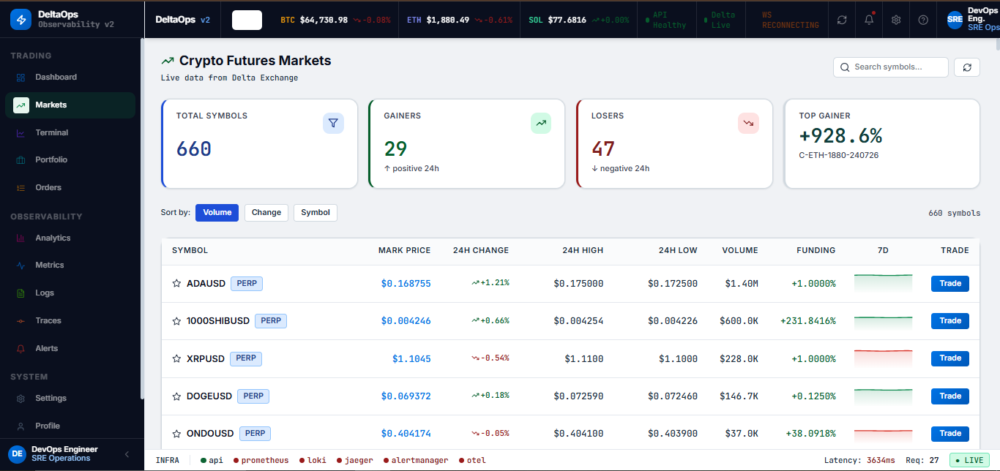
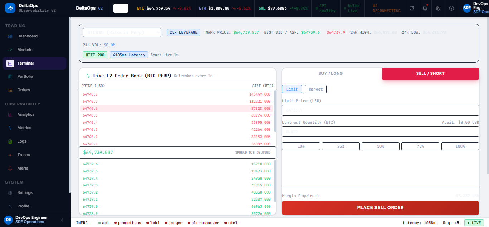
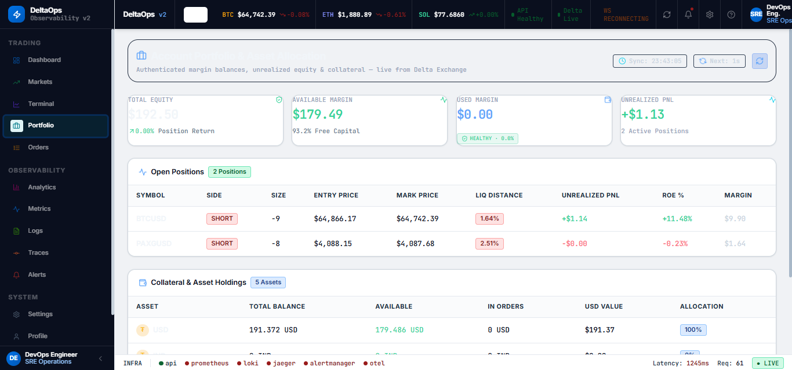
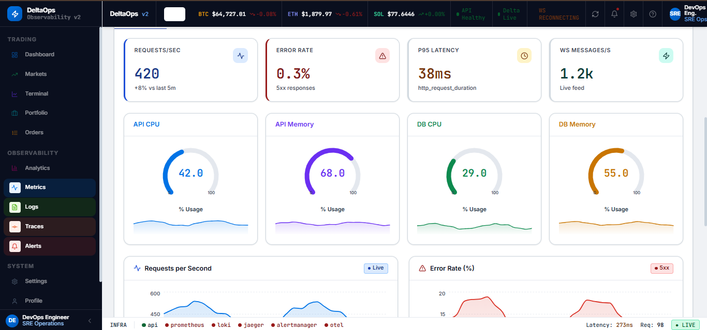
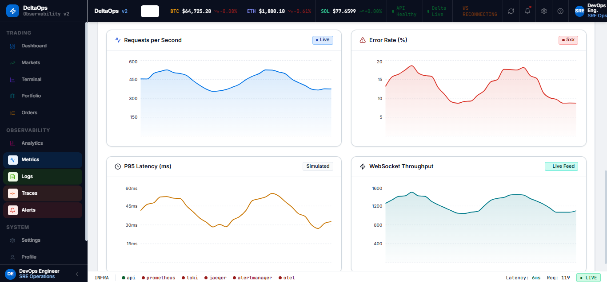

# 📸 DeltaOps Portfolio Showcase

This page displays the actual, live platform screenshots captured from the **DeltaOps** system.

---

## 💻 1. Web Application Viewports

### 📊 Executive Dashboard
Shows live price tickers, system latencies, backend connectivity status, and requests volumes.

### 📈 Trading Terminal
Integrates dynamic candlesticks chart, L2 bids/asks orderbook, execution orders interface, and active accounts telemetry.

### 🔍 Crypto Derivatives Market Directory
Lists all active tickers, price movements, daily volumes, funding interest, and open contracts.

### 💼 Portfolio Analytics
Renders total wallet equities, available margins, allocations percentage, and positions breakdowns.

---

## 🛡️ 2. Observability & Infrastructure Dashboards

### 🌐 Grafana Executive Overview
Auto-provisioned executive dashboard plotting live request rates, latency quantile quantifications (P95), and WS connections.

### 🔌 Grafana Infrastructure & Docker Health
Tracks host OS health, cAdvisor CPU/Memory container allocations, and Promtail log aggregations.

